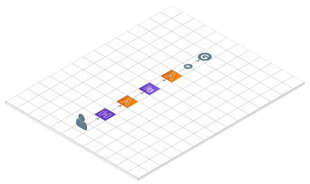

# Privera Community Edition (CE)

> The Analytics' Anonymization Proxy

Use the tools you know. Respect users' privacy. Forget cookie consents.
Comply with GDPR, ePrivacy, COPPA, CalOPPA, PECR, PIPEDA, CASL; you name it.

[Learn more about the project](https://privera.io).

<p align="center"> 
  
</p>

## Deployment

The project uses Go 1.16.

The easiest way to get this up and running is using
[AWS SAM](https://github.com/aws/serverless-application-model):

```bash
cd proxy-ce
sam build
sam deploy \
  --capabilities CAPABILITY_IAM \
  --parameter-overrides 'UAPropertyID=UA-XXXXX-Y' \
  --stack-name PriveraProxyCE
```

Once deployed, refer to the stack's output for the API endpoint and
update the `<head>` section of your HTML as follows:

```html
<script src="./aap.js" pe-endpoint="API_ENDPOINT" async></script>
```

## Contributing

> If you've discovered a security vulnerability, we appreciate your help
> disclosing it to us via [security@privera.io](mailto:security@privera.io).

We are grateful to the community for any contribution. You may, for example,
proof-read the documentation, submit bugs and fixes, provide improvements,
discuss new axes of evolution, or spread the word around you.

We are always thrilled to receive pull requests, and do our best to process them
as fast as we can. Before you start to code, we recommend discussing your plans
through the issue tracker, especially for more ambitious contributions. This
gives other contributors a chance to point you in the right direction, give you
feedback on your design, and help you find out if someone else is working on
the same thing.

## Cost and Licenses

You are responsible for the cost of the AWS services used while running this.

Distributed under the terms of the [Apache License (Version 2.0)](LICENSE).
